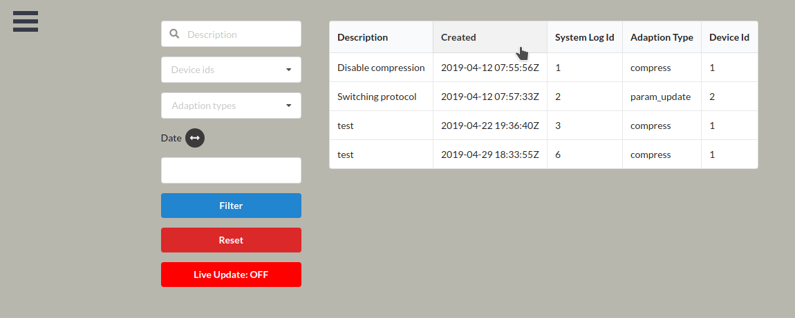

# SKRP &middot;  
Proof of concept showing the use of the [NetJSON](http://netjson.org) specification to collect
information about networks for monitoring purposes and making adaptions to the network for
optimisation purposes.

# Setup project
`git clone https://github.com/it2901/Skrp.git`

# Git guidelines
We work out of develop, and merge to master with stable releases. If working on
a feature, checkout a branch with your issue number and make sure your branch
has a descriptive name. E.g.

`git checkout -b 2-setup-ci-cd`

Once you are done developing™ your feature you can be a friend to the people
you work with, and rebase on develop

`git pull --rebase origin develop`.

Nice, you rewrote history. Push your branch (if you have already pushed it, you
might need to force-push). After your branch is pushed, create a pull request
and make sure someone does a code review for you. Once its reviewed, you can
merge / rebase it into develop.

# Database setup
A database can automatically be created by running `database/run_database.sh`.
This requires Docker to be installed and an internet connection (the first time).

It is also possible to create a database manually.
You need to have a postgres server and client installed to be able to setup
the database. Refer to [Postgresql downloads](https://www.postgresql.org/download/)
for instructions on how to get postgres running.

Once you have postgres running, you can run the `./setup_db.bash` script. You might
need to make it executable, which you can do with `chmod +x setup_db.bash`

To make the database work with the application, you need to make sure the `PGDATABASE` environment is set.
You can do this by running `export PGDATABASE="netjson_dev"`.

# Docker and docker-compose
To set up the whole project and run it with docker compose you will need to
refer to [Getting started with Docker compose](https://docs.docker.com/compose/gettingstarted/)

Once you have docker engine and docker compose setup, run `docker-compose up`
from the project root to run the project.

Once it is up, visit localhost:3000 in your browser.
